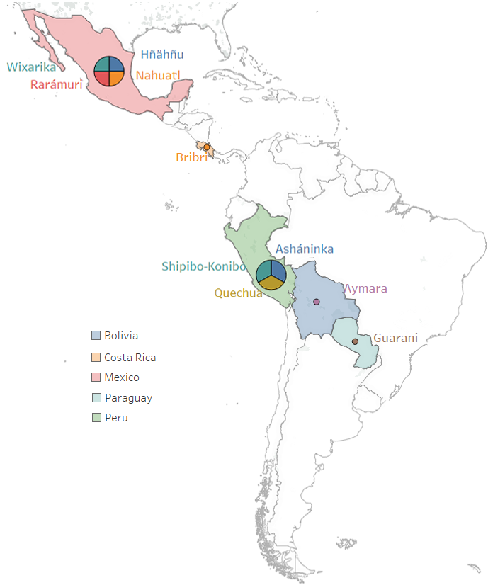

# IndT5: A Text-to-Text Transformer for 10 Indigenous Languages

In this work,  we introduce ```IndT5```, the  first  Transformer  language  model  for  Indigenous languages.  To train IndT5, we build ```IndCorpus```,  a  new  corpus  for 10 Indigenous languages  and  Spanish. We  also  present  the application  of  IndT5  to  machine  translation by    investigating    different    approaches    to translate between Spanish and the Indigenous languages  as  part  of  our  contribution  to  theAmericasNLP  2021  Shared  Task  on  OpenMachine  Translation.

# IndT5
We train an Indigenous language model adopting the unified and flexible
text-to-text transfer Transformer (T5) approach . T5 treats every
text-based language task as a “text-to-text" problem, taking text format
as input and producing new text format as output. T5 is essentially an
encoder-decoder Transformer , with the encoder and decoder similar in
configuration and size to a BERT<sub>Base</sub> but with some
architectural modifications. Modifications include applying a
normalization layer before a sub-block and adding a pre-norm (i.e.,
initial input to the sub-block output).

# IndCourpus
We build IndCorpus, a collection of 10 Indige-nous languages and Spanish comprising 1.17GB of text, from both Wikipedia and the Bible.

### Demographic information of 10 Indigenous languages
|   **Language**   | **Language Code** | **Main Location** | **Number of Speakers** | 
|------------------|-------------------|-------------------|------------------------|
| Aymara           | aym               | Bolivia           | 1,677,100              |
| Asháninka        | cni               | Peru              | 35,200                 |
| Bribri           | bzd               | Costa Rica        | 7,000                  |
| Guarani          | gn                | Paraguay          | 6,652,790              |
| Hñähñu           | oto               | Mexico            | 88,500                 |
| Nahuatl          | nah               | Mexico            | 410,000                |
| Quechua          | quy               | Peru              | 7,384,920              |
| Rarámuri         | tar               | Mexico            | 9,230                  |
| Shipibo-Konibo   | shp               | Peru              | 22,500                 |
| Wixarika         | hch               | Mexico            | 52,500                 |

### Data size and number of sentences in monolingual dataset (collected from Wikipedia and Bible)
| **Target Language** | **Wiki Size (MB)**        | **Wiki #Sentences**           | **Bible Size (MB)**  | **Bible #Sentences**|
|-------------------|------------------|-------------------|------------------------|-|
|Hñähñu                   | -                |    -                             | 1.4     |    7.5K                                          |
|Wixarika                 | -            |       -                             |  1.3   |   7.5K|
|Nahuatl                  | 5.8           |    61.1K                         | 1.5  |      7.5K|
|Guarani                  | 3.7            |      28.2K                           | 1.3 |      7.5K                                              |
|Bribri                   | -               |    -                             | 1.5  |        7.5K                                        |
|Rarámuri                 | -                |     -                            | 1.9  |         7.5K                                       |
|Quechua                  | 5.9               |     97.3K                        | 4.9   |    31.1K                                            |
|Aymara                   | 1.7                |     32.9K                         | 5   | 30.7K|
|Shipibo-Konibo           | -                   |     -                         | 1    |    7.9K                                             |
|Asháninka                | -                    |     -                       | 1.4    |   7.8K                                          |
|Spanish                      | 1.13K             |    5M    | -              | - |
|Total | 1.15K  |  5.22M   |    19.8 |     125.3K|


# Parallel datasets for machine translation 
The datasets are provided by AmericasNLP 2021 Shared Task on Open Machine Translation (https://github.com/AmericasNLP/americasnlp2021).
### Number of sentences in parallel dataset (train, dev and test set)
| **Language Pair** | **Train**        | **Dev**           | **Test**               | 
|-------------------|------------------|-------------------|------------------------|
|es-aym    | 6,531 | 996   | 1,003   |
|es-cni  | 3,883  | 883   | 1,003 |
|es-bzd   | 7,506  | 996   | 1,003   |
|es-gn   | 26,032 | 995   |  1,003   |
|es-oto   | 4,889 | 599   | 1,003 |
|es-nah    | 16,145 | 672   | 1,003   |
|es-quy  | 125,008  | 996   | 1,003   |
|es-tar   | 14,720  | 995   | 1,003   |
|es-shp  | 14,592 | 996   |  1,003   |
|es-hch  | 8,966 | 994   | 1,003  |


